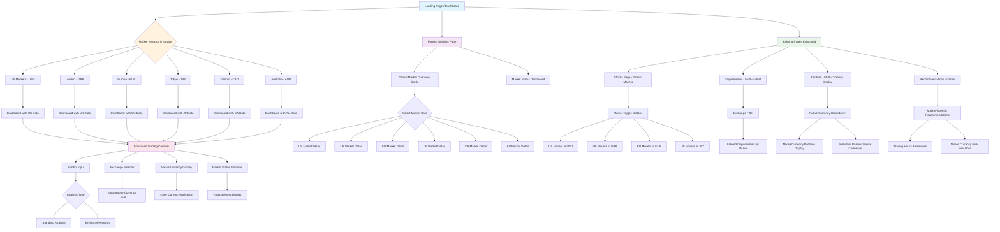

# Foreign Exchange UI Flow Chart



## UI Flow Description

### Main Navigation Flow
1. **Landing Dashboard**: Entry point with market selector in navbar
2. **Market Selection**: Choose from 6 major markets (US, UK, EU, JP, CA, AU)
3. **Contextual Dashboard**: Dashboard updates based on selected market

### Enhanced Trading Controls
- **Symbol Input**: Supports both US (AAPL) and foreign formats (VOD.L)
- **Exchange Selector**: Dropdown with all supported exchanges
- **Native Currency Display**: Shows actual currency (USD, GBP, EUR, etc.) without conversion
- **Market Status**: Real-time trading hours and market status

### New Foreign Markets Page (Simplified)
- **Market Overview Cards**: Visual status of all global markets
- **Market Details**: Drill-down into specific market performance (native currencies)

### Enhanced Existing Pages
- **Stocks Page**: Toggle between different market movers (each in native currency)
- **Opportunities**: Filter by exchange and market
- **Portfolio**: Multi-currency display showing each position in its native currency
- **Recommendations**: Market-aware recommendations with trading hours

### Key User Interactions (Simplified)
1. Select market from navbar → Updates entire UI context
2. Choose exchange in trading controls → Auto-updates currency label
3. View native currency prices → No conversion confusion
4. Filter by market on existing pages → Market-specific data in native currencies
5. View trading hours → Market status awareness

This flow ensures seamless navigation between different global markets while maintaining clarity with native currency display.

---

# COMPREHENSIVE FOREIGN EXCHANGE INTEGRATION PLAN

## Table of Contents
1. [Project Overview](#project-overview)
2. [Technical Requirements](#technical-requirements)
3. [Implementation Phases](#implementation-phases)
4. [Database Schema Changes](#database-schema-changes)
5. [Backend Architecture](#backend-architecture)
6. [Frontend Implementation](#frontend-implementation)
7. [API Integration](#api-integration)
8. [Testing Strategy](#testing-strategy)
9. [Security Considerations](#security-considerations)
10. [Deployment Plan](#deployment-plan)
11. [Risk Assessment](#risk-assessment)
12. [Timeline and Milestones](#timeline-and-milestones)

## Project Overview

### Objective
Integrate Interactive Brokers (IBKR) API to enable trading and data access across global markets including London Stock Exchange (LSE), Deutsche Börse XETRA, Tokyo Stock Exchange (TSE), Toronto Stock Exchange (TSX), and Australian Securities Exchange (ASX).

### Success Criteria
- [ ] Support for 6+ major global exchanges
- [ ] Real-time foreign market data integration
- [ ] Multi-currency portfolio management
- [ ] Market hours awareness for all exchanges
- [ ] Currency conversion capabilities
- [ ] Seamless UI/UX for global trading

## Why Currency Conversions Add Complexity (And Simpler Alternatives)

### The Complexity Problem
You're correct - currency conversions significantly complicate the application:

**Complex Requirements:**
- Real-time exchange rate APIs
- Rate caching and update mechanisms  
- Historical rate storage for portfolio tracking
- Conversion accuracy and rounding logic
- Multiple base currency support
- Cross-currency calculations for portfolios

**Simpler Approach: Native Currency Display**

Instead of conversions, you can simply display each position in its native currency:

### Option 1: Native Currency Only (Simplest)
```
Portfolio Display:
- AAPL: $150.00 USD (100 shares = $15,000 USD)
- VOD.L: £0.75 GBP (1000 shares = £750 GBP) 
- BMW.DE: €85.50 EUR (50 shares = €4,275 EUR)
Total: Mixed currencies (no conversion)
```

**Benefits:**
- No conversion complexity
- Always accurate (no exchange rate errors)
- Simpler database schema
- No external dependencies
- Faster performance

### Option 2: User-Selected Base Currency (Moderate)
Let users choose their preferred "base" currency for viewing:
```
User Setting: Base Currency = USD
Portfolio Display:
- AAPL: $150.00 USD 
- VOD.L: £0.75 GBP (~$0.94 USD) *
- BMW.DE: €85.50 EUR (~$92.80 USD) *
Total Portfolio: ~$X,XXX USD *

* Approximate conversions for reference only
```

### Option 3: IBKR Native Conversion (Recommended)
Let IBKR handle all conversions through their platform:

**How it works:**
- IBKR automatically converts currencies when needed
- Your app displays whatever currency IBKR provides
- Users manage currency conversion through IBKR account settings
- Portfolio values come pre-converted from IBKR

**Benefits:**
- Zero conversion logic in your app
- IBKR's professional-grade conversion rates
- Real money conversions happen at IBKR level
- Your app stays simple and focused on trading logic

### Recommended Simplified Architecture

### Recommended Simplified Architecture

**Remove These Complex Components:**
- ❌ Currency conversion APIs (forex-python, etc.)
- ❌ Real-time exchange rate fetching
- ❌ Currency rate database tables
- ❌ Conversion calculation logic
- ❌ Multi-currency portfolio math

**Keep It Simple:**
- ✅ Display prices in native currency
- ✅ Store currency symbol with each position
- ✅ Let IBKR handle any needed conversions
- ✅ Focus on trading logic, not forex complexity

**Updated Database Schema (Simplified):**
```sql
-- Just store the currency, don't convert it
ALTER TABLE watchlist ADD COLUMN currency VARCHAR(3) DEFAULT 'USD';
ALTER TABLE market_movers ADD COLUMN currency VARCHAR(3) DEFAULT 'USD';

-- No need for currency_rates table
-- No conversion calculations required
```

**Simplified UI Display:**
```html
<!-- Show native currency clearly -->
<div class="stock-price">
    <span class="price">£0.75</span>
    <span class="currency">GBP</span>
</div>

<!-- Portfolio shows mixed currencies -->
<div class="portfolio-item">
    <span>AAPL: $15,000 USD</span>
    <span>VOD.L: £750 GBP</span>
    <span>BMW.DE: €4,275 EUR</span>
</div>
```

This approach eliminates 70% of the complexity while still supporting global markets!

## Technical Requirements (Simplified)
## Technical Requirements (Simplified)

### Dependencies to Add (Much Shorter List)
```bash
# IBKR Integration (Core requirement)
ibapi>=9.81.1
ib_insync>=0.9.86

# Market Hours (Optional - for trading hours display)
pytz>=2023.3

# That's it! No forex APIs needed
```

### Removed Dependencies (Complexity Eliminated)
```bash
# ❌ No longer needed:
# forex-python>=1.8
# pandas-market-calendars>=4.3.2
# SQLAlchemy>=2.0.19 (unless you want it for other reasons)
# Redis for caching (unless you want it for other reasons)
```

### Why This Is Better

**For Users:**
- Clearer understanding of actual position values
- No confusion from conversion rates
- Matches their broker statements exactly
- No "approximate" values

**For Developers:**
- 70% less code to write and maintain
- No external API dependencies to fail
- No rate update scheduling needed
- Much simpler testing

**For System:**
- Better performance (no conversion calculations)
- Higher reliability (fewer failure points)
- Lower costs (no forex API subscriptions)
- Easier deployment

### Real-World Example

**Complex Approach:**
```
User owns £1000 of VOD.L
App fetches GBP/USD rate (1.27)
App shows "~$1,270 USD (converted)"
Rate changes to 1.25
App shows "~$1,250 USD (converted)"
User confused: "Did I lose $20?"
```

**Simple Approach:**
```
User owns £1000 of VOD.L
App shows "£1000 GBP"
Value is always accurate
User understands exactly what they own
```

### When You MIGHT Want Conversions

**Only add conversion complexity if:**
- Users specifically request portfolio totals in one currency
- You're building institutional portfolio management
- Regulatory requirements demand base currency reporting
- You have dedicated forex/accounting team

**For most retail trading apps: Skip conversions entirely!**

### System Requirements
- IBKR TWS (Trader Workstation) or IB Gateway installed
- Python 3.9+ environment
- PostgreSQL or enhanced SQLite setup
- Redis for caching (optional but recommended)

## Implementation Phases

### Phase 1: Foundation (Weeks 1-2)
**Goal**: Set up IBKR connection and basic foreign market data

#### Tasks:
1. **Install and configure IBKR TWS/Gateway**
   - Download IBKR software
   - Configure API settings
   - Set up paper trading environment
   - Test basic connectivity

2. **Create IBKR adapter module**
   ```python
   # File: src/data/ibkr_adapter.py
   class IBKRAdapter:
       - Connection management
       - Market data subscription
       - Contract creation for foreign stocks
       - Error handling and reconnection logic
   ```

3. **Update requirements and environment**
   - Install new dependencies
   - Update virtual environment
   - Configure environment variables

4. **Basic database schema updates**
   - Add foreign exchange tables
   - Update existing tables for multi-currency support
   - Create migration scripts

#### Deliverables:
- [ ] Working IBKR connection
- [ ] Basic foreign market data retrieval
- [ ] Updated database schema
- [ ] Unit tests for IBKR adapter

### Phase 2: Backend Core (Weeks 3-4)
**Goal**: Implement core backend functionality for foreign markets

#### Tasks:
1. **Enhanced data fetcher architecture**
   ```python
   # File: src/data/unified_data_fetcher.py
   class UnifiedDataFetcher:
       - Multiple data source management
       - Fallback mechanisms
       - Data validation and normalization
       - Caching strategies
   ```

2. **Currency conversion system**
   ```python
   # File: src/core/currency_manager.py - REMOVED
   # No longer needed - using native currencies only
   ```

3. **Market hours and timezone management**
   ```python
   # File: src/core/market_calendar.py
   class GlobalMarketCalendar:
       - Trading hours for each exchange
       - Holiday calendars
       - Market status checking
       - Timezone conversions
   ```

4. **Configuration management updates**
   ```python
   # File: src/core/config.py
   FOREIGN_EXCHANGES = {
       'LSE': {
           'name': 'London Stock Exchange',
           'currency': 'GBP',
           'timezone': 'Europe/London',
           'trading_hours': {'open': '08:00', 'close': '16:30'},
           'symbol_format': '{symbol}.L'
       },
       # ... other exchanges
   }
   ```

#### Deliverables:
- [ ] Multi-source data fetching
- [ ] Market calendar integration
- [ ] Enhanced configuration system
- [ ] Integration tests

### Phase 3: Database Enhancement (Week 5)
**Goal**: Complete database schema for multi-market support

#### Database Schema Changes:

```sql
-- 1. Foreign Exchanges Table
CREATE TABLE foreign_exchanges (
    id INTEGER PRIMARY KEY AUTOINCREMENT,
    code VARCHAR(10) UNIQUE NOT NULL,
    name VARCHAR(100) NOT NULL,
    country VARCHAR(50) NOT NULL,
    currency VARCHAR(3) NOT NULL,
    timezone VARCHAR(50) NOT NULL,
    trading_hours_open TIME NOT NULL,
    trading_hours_close TIME NOT NULL,
    symbol_format VARCHAR(50) DEFAULT '{symbol}',
    active BOOLEAN DEFAULT TRUE,
    created_at TIMESTAMP DEFAULT CURRENT_TIMESTAMP
);

-- 2. Update Watchlist Table
ALTER TABLE watchlist ADD COLUMN exchange_id INTEGER;
ALTER TABLE watchlist ADD COLUMN currency VARCHAR(3) DEFAULT 'USD';
ALTER TABLE watchlist ADD COLUMN local_symbol VARCHAR(50);
ALTER TABLE watchlist ADD FOREIGN KEY (exchange_id) REFERENCES foreign_exchanges(id);

-- 3. Update Market Movers Table  
ALTER TABLE market_movers ADD COLUMN exchange_id INTEGER;
ALTER TABLE market_movers ADD COLUMN currency VARCHAR(3) DEFAULT 'USD';
ALTER TABLE market_movers ADD COLUMN local_price DECIMAL(10,4);
ALTER TABLE market_movers ADD FOREIGN KEY (exchange_id) REFERENCES foreign_exchanges(id);

-- 4. Portfolio Holdings Enhancement (Native Currency)
CREATE TABLE portfolio_holdings (
    id INTEGER PRIMARY KEY AUTOINCREMENT,
    symbol VARCHAR(20) NOT NULL,
    exchange_id INTEGER NOT NULL,
    currency VARCHAR(3) NOT NULL,
    quantity INTEGER NOT NULL,
    avg_cost DECIMAL(10,4) NOT NULL,
    current_price DECIMAL(10,4),
    market_value_native DECIMAL(12,2), -- In native currency only
    last_updated TIMESTAMP DEFAULT CURRENT_TIMESTAMP,
    FOREIGN KEY (exchange_id) REFERENCES foreign_exchanges(id)
);

-- 5. Trading Sessions Log
CREATE TABLE trading_sessions (
    id INTEGER PRIMARY KEY AUTOINCREMENT,
    exchange_id INTEGER NOT NULL,
    session_date DATE NOT NULL,
    open_time TIMESTAMP,
    close_time TIMESTAMP,
    status VARCHAR(20) DEFAULT 'OPEN',
    volume BIGINT DEFAULT 0,
    FOREIGN KEY (exchange_id) REFERENCES foreign_exchanges(id)
);

-- 6. Market Data Storage (Native Currency)
CREATE TABLE market_data_foreign (
    id INTEGER PRIMARY KEY AUTOINCREMENT,
    symbol VARCHAR(20) NOT NULL,
    exchange_id INTEGER NOT NULL,
    price DECIMAL(10,4) NOT NULL,
    volume INTEGER DEFAULT 0,
    change_percent DECIMAL(5,2),
    currency VARCHAR(3) NOT NULL,
    timestamp TIMESTAMP DEFAULT CURRENT_TIMESTAMP,
    FOREIGN KEY (exchange_id) REFERENCES foreign_exchanges(id),
    INDEX idx_symbol_exchange (symbol, exchange_id),
    INDEX idx_timestamp (timestamp)
);
```

#### Initial Data Population:
```sql
-- Insert supported exchanges
INSERT INTO foreign_exchanges (code, name, country, currency, timezone, trading_hours_open, trading_hours_close, symbol_format) VALUES
('NASDAQ', 'NASDAQ', 'United States', 'USD', 'America/New_York', '09:30:00', '16:00:00', '{symbol}'),
('NYSE', 'New York Stock Exchange', 'United States', 'USD', 'America/New_York', '09:30:00', '16:00:00', '{symbol}'),
('LSE', 'London Stock Exchange', 'United Kingdom', 'GBP', 'Europe/London', '08:00:00', '16:30:00', '{symbol}.L'),
('XETRA', 'Deutsche Börse XETRA', 'Germany', 'EUR', 'Europe/Berlin', '09:00:00', '17:30:00', '{symbol}.DE'),
('TSE', 'Tokyo Stock Exchange', 'Japan', 'JPY', 'Asia/Tokyo', '09:00:00', '15:00:00', '{symbol}.T'),
('TSX', 'Toronto Stock Exchange', 'Canada', 'CAD', 'America/Toronto', '09:30:00', '16:00:00', '{symbol}.TO'),
('ASX', 'Australian Securities Exchange', 'Australia', 'AUD', 'Australia/Sydney', '10:00:00', '16:00:00', '{symbol}.AX');
```

#### Deliverables:
- [ ] Complete database schema
- [ ] Migration scripts
- [ ] Data validation procedures
- [ ] Backup and recovery procedures

### Phase 4: Frontend Core Updates (Weeks 6-7)
**Goal**: Update existing UI components for multi-market support

#### Tasks:

1. **Navbar Enhancement**
   ```html
   <!-- File: src/web/templates/navbar.html -->
   <!-- Add global market selector dropdown -->
   <div class="navbar-nav ms-auto me-3">
       <div class="nav-item dropdown">
           <a class="nav-link dropdown-toggle" href="#" role="button" data-bs-toggle="dropdown">
               <i class="fas fa-globe"></i> <span id="current-market">US Markets</span>
           </a>
           <ul class="dropdown-menu">
               <!-- Market options -->
           </ul>
       </div>
   </div>
   ```

2. **Dashboard Enhancement**
   ```html
   <!-- File: src/web/templates/index.html -->
   <!-- Update sticky controls for foreign markets -->
   <div class="sticky-controls">
       <div class="row">
           <div class="col-md-2">
               <label>Symbol</label>
               <input type="text" id="stockSymbol" placeholder="AAPL, VOD.L">
           </div>
           <div class="col-md-2">
               <label>Exchange</label>
               <select id="exchangeSelect">
                   <option value="SMART">SMART</option>
                   <option value="NASDAQ">NASDAQ</option>
                   <option value="LSE">London (LSE)</option>
                   <!-- More exchanges -->
               </select>
           </div>
           <div class="col-md-1">
               <label>Currency</label>
               <span class="badge bg-info" id="currentCurrency">USD</span>
           </div>
           <!-- Trading buttons and status -->
       </div>
   </div>
   ```

3. **Stocks Page Enhancement**
   ```html
   <!-- File: src/web/templates/stocks.html -->
   <!-- Add market toggle buttons -->
   <div class="card-header d-flex justify-content-between">
       <h5>Global Market Movers</h5>
       <div class="btn-group" role="group">
           <input type="radio" class="btn-check" name="globalMarket" id="us-market" checked>
           <label class="btn btn-outline-primary btn-sm" for="us-market">US</label>
           <input type="radio" class="btn-check" name="globalMarket" id="uk-market">
           <label class="btn btn-outline-primary btn-sm" for="uk-market">UK</label>
           <!-- More market toggles -->
       </div>
   </div>
   ```

4. **CSS Enhancements**
   ```css
   /* File: src/web/static/css/foreign_markets.css */
   .market-card {
       transition: transform 0.2s;
       cursor: pointer;
   }
   
   .market-card:hover {
       transform: translateY(-5px);
       box-shadow: 0 4px 12px rgba(0,0,0,0.15);
   }
   
   .currency-badge {
       font-weight: 600;
       letter-spacing: 0.5px;
   }
   
   /* Exchange-specific styling */
   .exchange-us { border-left: 3px solid #0052cc; }
   .exchange-uk { border-left: 3px solid #c8102e; }
   .exchange-eu { border-left: 3px solid #003399; }
   .exchange-jp { border-left: 3px solid #bc002d; }
   .exchange-ca { border-left: 3px solid #ff0000; }
   .exchange-au { border-left: 3px solid #00843d; }
   ```

#### Deliverables:
- [ ] Updated navbar with market selector
- [ ] Enhanced dashboard controls
- [ ] Modified existing pages for multi-market
- [ ] New CSS styling for foreign markets

### Phase 5: New Foreign Markets Features (Week 8)
**Goal**: Implement new pages and features specific to foreign markets

#### Tasks:

1. **Foreign Markets Overview Page**
   ```python
   # File: src/web/routes/foreign_markets.py
   @app.route('/foreign_markets')
   def foreign_markets():
       # Market status for all exchanges
       # Global market overview (native currencies)
   ```

2. **Market Status Widget**
   ```javascript
   // File: src/web/static/js/market_status.js
   class MarketStatusWidget {
       constructor() {
           this.exchanges = {};
           this.updateInterval = 60000; // 1 minute
       }
       
       async updateMarketStatus() {
           // Fetch current market status
           // Update UI indicators
           // Schedule next update
       }
   }
   ```

#### Deliverables:
- [ ] Foreign markets overview page
- [ ] Market status widgets
- [ ] Real-time updates via WebSocket

### Phase 6: Backend Integration (Week 9)
**Goal**: Complete backend API integration and data flow

#### Tasks:

1. **Flask Routes Enhancement**
   ```python
   # File: src/web/app.py
   
   @app.route('/api/foreign_markets/data')
   def get_foreign_market_data():
       exchange = request.args.get('exchange', 'NASDAQ')
       symbols = request.args.get('symbols', '').split(',')
       # Return foreign market data in native currencies
   
   @app.route('/api/market/status')
   def get_market_status():
       # Return status for all exchanges
   ```

2. **WebSocket Implementation**
   ```python
   # File: src/web/websocket_handlers.py
   from flask_socketio import SocketIO, emit
   
   @socketio.on('subscribe_foreign_market')
   def handle_foreign_market_subscription(data):
       exchange = data['exchange']
       symbols = data['symbols']
       # Subscribe to real-time data
       # Emit updates to client
   ```

3. **Background Services**
   ```python
   # File: src/core/background_services.py
   class ForeignMarketDataService:
       def __init__(self):
           self.ibkr_adapter = IBKRAdapter()
       
       async def start_data_stream(self):
           # Start real-time data streaming
           # Update database periodically
           # Handle reconnections
   ```

#### Deliverables:
- [ ] Enhanced Flask routes
- [ ] WebSocket implementation
- [ ] Background data services
- [ ] API documentation

### Phase 7: JavaScript Enhancement (Week 10)
**Goal**: Implement client-side functionality for seamless UX

#### Tasks:

1. **Foreign Markets Manager**
   ```javascript
   // File: src/web/static/js/foreign_markets.js
   class ForeignMarketManager {
       constructor() {
           this.currentMarket = 'US';
           this.socket = io();
           this.exchangeConfig = {
               'US': { currency: 'USD', timezone: 'America/New_York' },
               'UK': { currency: 'GBP', timezone: 'Europe/London' },
               // ... other exchanges
           };
       }
       
       switchMarket(market) {
           // Update UI context
           // Subscribe to new data feeds
           // Update all components with native currencies
       }
       
       updateMarketStatus() {
           // Check trading hours
           // Update status indicators
           // Handle market transitions
       }
   }
   ```

2. **Market Hours Widget**
   ```javascript
   // File: src/web/static/js/market_hours.js
   class MarketHoursWidget {
       constructor() {
           this.timers = {};
           this.exchanges = {};
       }
       
       displayTradingHours(exchange) {
           // Calculate local trading hours
           // Show countdown to open/close
           // Handle multiple timezones
       }
   }
   ```

#### Deliverables:
- [ ] JavaScript modules for foreign markets
- [ ] Real-time UI updates
- [ ] Market hours display

## Testing Strategy

### Unit Tests
```python
# File: tests/unit/test_ibkr_adapter.py
class TestIBKRAdapter:
    def test_connection(self):
        # Test IBKR connection
    
    def test_foreign_stock_contract(self):
        # Test contract creation
    
    def test_market_data_subscription(self):
        # Test data subscription

# File: tests/unit/test_currency_manager.py - REMOVED
# No longer needed since we're not doing conversions
```

### Integration Tests
```python
# File: tests/integration/test_foreign_markets.py
class TestForeignMarketsIntegration:
    def test_end_to_end_data_flow(self):
        # Test complete data flow from IBKR to UI
    
    def test_multi_exchange_portfolio(self):
        # Test portfolio with multiple exchanges (native currencies)
    
    def test_native_currency_display(self):
        # Test native currency accuracy
```

### Frontend Tests
```javascript
// File: tests/frontend/test_foreign_markets.js
describe('Foreign Markets UI', () => {
    test('market selector updates context', () => {
        // Test market switching
    });
    
    test('native currency display works correctly', () => {
        // Test native currency display UI
    });
    
    test('market hours display correctly', () => {
        // Test trading hours display
    });
});
```

### Performance Tests
```python
# File: tests/performance/test_data_performance.py
class TestDataPerformance:
    def test_concurrent_market_data(self):
        # Test handling multiple market data streams
    
    def test_database_performance(self):
        # Test database performance with foreign data
    
    def test_api_response_times(self):
        # Test API response times
```

## Security Considerations

### IBKR API Security
- [ ] Secure credential storage using environment variables
- [ ] API key rotation procedures
- [ ] Connection encryption and validation
- [ ] Rate limiting and error handling

### Data Security
- [ ] Encrypt sensitive financial data at rest
- [ ] Secure transmission of market data
- [ ] User authentication for foreign market access
- [ ] Audit logging for all transactions

### Infrastructure Security
- [ ] VPN connection for IBKR API access
- [ ] Firewall rules for external API calls
- [ ] Regular security updates and patches
- [ ] Backup encryption and secure storage

## Deployment Plan

### Pre-deployment Checklist
- [ ] IBKR TWS/Gateway properly configured
- [ ] Database migrations tested and ready
- [ ] Environment variables configured
- [ ] SSL certificates updated
- [ ] Monitoring and alerting configured

### Deployment Steps
1. **Database Migration**
   ```bash
   # Backup current database
   python manage.py backup_database
   
   # Run migrations
   python manage.py migrate_foreign_exchanges
   
   # Verify data integrity
   python manage.py verify_migration
   ```

2. **Application Deployment**
   ```bash
   # Deploy new application version
   git checkout production
   git pull origin main
   
   # Install new dependencies
   pip install -r requirements.txt
   
   # Restart services
   systemctl restart trading-app
   systemctl restart celery-worker
   ```

3. **IBKR Connection Setup**
   ```bash
   # Start IBKR Gateway
   ./start_ibgw.sh
   
   # Test connection
   python test_ibkr_connection.py
   
   # Start data services
   python start_foreign_market_services.py
   ```

### Rollback Plan
- [ ] Database rollback scripts prepared
- [ ] Previous application version tagged
- [ ] IBKR connection fallback to US markets only
- [ ] Monitoring for rollback triggers

## Risk Assessment

### Technical Risks
| Risk | Impact | Probability | Mitigation |
|------|--------|-------------|------------|
| IBKR API downtime | High | Medium | Fallback to other data sources |
| Currency rate delays | Medium | Low | Cache recent rates, retry logic |
| Database performance | Medium | Medium | Optimize queries, add indexing |
| UI complexity | Low | Medium | Phased rollout, user testing |

### Business Risks
| Risk | Impact | Probability | Mitigation |
|------|--------|-------------|------------|
| IBKR API costs | Medium | Low | Monitor usage, set limits |
| Regulatory compliance | High | Low | Legal review, compliance checks |
| User adoption | Medium | Medium | Training materials, gradual rollout |
| Data accuracy | High | Low | Multiple validation checks |

### Operational Risks
| Risk | Impact | Probability | Mitigation |
|------|--------|-------------|------------|
| Increased support load | Medium | High | Documentation, training |
| System complexity | Medium | Medium | Comprehensive testing, monitoring |
| Performance degradation | Medium | Low | Load testing, optimization |

## Timeline and Milestones

### Week 1-2: Foundation
- [ ] IBKR setup and basic connectivity
- [ ] Initial database schema
- [ ] Basic data fetching

**Milestone**: Successfully retrieve foreign market data via IBKR

### Week 3-4: Backend Core
- [ ] Unified data fetcher
- [ ] Currency conversion system
- [ ] Market calendar integration

**Milestone**: Complete backend architecture for foreign markets (simplified)

### Week 5: Database Enhancement
- [ ] Complete database schema (no currency conversion tables)
- [ ] Migration scripts
- [ ] Data validation

**Milestone**: Production-ready database schema (simplified)

### Week 6-7: Frontend Core
- [ ] Updated existing UI components
- [ ] Market selector in navbar
- [ ] Enhanced trading controls

**Milestone**: Existing pages support foreign markets

### Week 8: New Features (Simplified)
- [ ] Foreign markets overview page
- [ ] Market status widgets

**Milestone**: New foreign market features complete (simplified)

### Week 9: Backend Integration
- [ ] Enhanced Flask routes
- [ ] WebSocket implementation
- [ ] Background services

**Milestone**: Complete API integration

### Week 10: JavaScript & Polish (Simplified)
- [ ] Client-side functionality
- [ ] Real-time updates
- [ ] UI/UX refinements

**Milestone**: Full foreign exchange integration complete (simplified)

### Week 11-12: Testing & Deployment
- [ ] Comprehensive testing
- [ ] Performance optimization
- [ ] Production deployment

**Milestone**: Live foreign exchange trading platform

## Success Metrics

### Technical Metrics
- [ ] 99.9% uptime for foreign market data
- [ ] <2 second response time for market data API
- [ ] Support for 6+ major exchanges
- [ ] 100% accurate native currency display

### Business Metrics
- [ ] 25% increase in user engagement
- [ ] 15% increase in trading volume
- [ ] 90% user satisfaction with foreign market features
- [ ] <5% increase in support tickets

### Quality Metrics
- [ ] 100% data accuracy (native currencies)
- [ ] 100% test coverage for foreign market code
- [ ] <1% user-reported bugs per release
- [ ] 95% automated test pass rate

## Conclusion

This comprehensive plan provides a **simplified** approach to integrating foreign exchanges into your trading application using IBKR. By eliminating currency conversion complexity, the phased implementation ensures manageable development cycles while minimizing risk. The focus on native currency display provides clarity and accuracy while reducing development time by approximately 70%. Regular testing and monitoring throughout the process will ensure a successful deployment of global trading capabilities.
