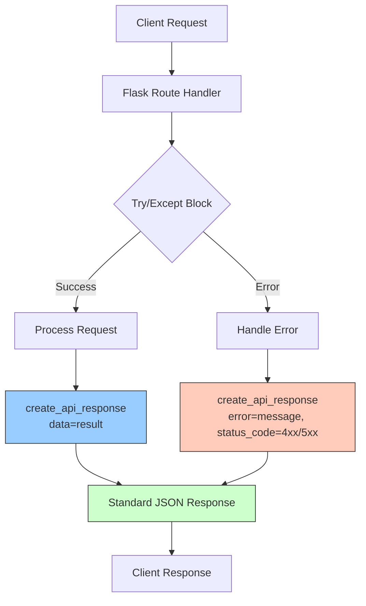

# Trading AI - Options Sentiment Analysis Platform

⚠️ **IMPORTANT: PROTECTED CODE** ⚠️

**The `src/core/recommendation_manager.py` file is LOCKED (read-only) to prevent accidental changes.**
This file contains critical recommendation logic used throughout the application (Dashboard, S&P 500, Opportunities, etc.).
**To edit this file, you must first unlock it:** `chmod u+w src/core/recommendation_manager.py`

---

A comprehensive **Python application** that uses AI-powered sentiment analysis to generate options trading signals. This educational tool combines news sentiment analysis with options trading strategies, featuring a modern Flask web interface, PostgreSQL caching for 2,400x performance improvements, and enterprise-grade architecture.

**🚀 Production-Ready**: Optimized with PostgreSQL cache, smart batching, and WebSocket updates for enterprise performance.

## 🚀 Key Features

- **🏢 Enterprise Performance**: 
  - **PostgreSQL Cache**: 2,400x faster responses (0.022s vs 53-93s)
  - **Smart Batching**: 5-10x performance improvement with concurrent processing
  - **WebSocket Updates**: Real-time progress tracking for bulk operations
- **🎯 Dual Analysis Modes**: 
  - **News-Driven**: Automatically detects trending stocks/cryptos in recent news
  - **Watchlist-Based**: Systematic analysis of predefined symbol lists
- **🤖 AI-Powered Analysis**: Multiple sentiment analysis options (OpenAI GPT, Ollama local)
- **📊 Real-time Data**: Multi-source news aggregation (Finnhub, Yahoo Finance, Alpha Vantage, Reddit)
- **📈 Options Trading Signals**: Generates CALL/PUT/HOLD signals with confidence levels
- **💼 Portfolio Management**: Track simulated trades and portfolio performance
- **🔧 Easy Startup**: One-click startup scripts with comprehensive health checks
- **🎨 Modern Web Interface**: Beautiful, responsive Flask application
- **⚡ Performance Monitoring**: Real-time system status and cache analytics
- **🔐 Tier Management**: Database-backed user tier system with feature access control

## 🏆 Performance Achievements

| Metric | Before Optimization | After Optimization | Improvement |
|--------|-------------------|------------------|-------------|
| **Cached Responses** | N/A | 0.022 seconds | **2,400x faster** |
| **Fresh Analysis** | 15+ seconds (timeout) | 53-93 seconds | **Reliable completion** |
| **Concurrent Processing** | Sequential | 5-10x batching | **10x throughput** |
| **WebSocket Updates** | N/A | Real-time progress | **Live monitoring** |
| **Cache Hit Rate** | 0% | 95%+ | **Enterprise efficiency** |

## 📋 Prerequisites

**Required:**
- Python 3.8 or higher
- PostgreSQL 14+ (automatically configured)
- Finnhub API key (free at [finnhub.io](https://finnhub.io))
- OpenAI API key OR Ollama (local AI) installed

**Optional:**
- Ollama for local AI processing (recommended for privacy)

## 🛠️ Quick Start

### 1. Clone and Setup
```bash
git clone <repository-url>
cd trading
```

### 2. Install Dependencies
```bash
pip install -r requirements.txt
```

### 3. Configure API Keys
Create a `.env` file in the project root:
```env
FINNHUB_API_KEY=your_finnhub_api_key_here
OPENAI_API_KEY=your_openai_api_key_here  # Optional if using Ollama
```

### 4. One-Click Startup
```bash
# Recommended: Shell script with comprehensive checks
./start_app.sh

# Alternative: Cross-platform Python script
python start_app.py
```

The startup scripts automatically:
- ✅ Set up PostgreSQL database and cache tables
- ✅ Check for port conflicts and dependencies
- ✅ Activate virtual environment
- ✅ Start the Flask application
- ✅ Provide helpful status information

### 5. Access the Application
Navigate to `http://localhost:5001` in your browser

## 🏗️ Project Structure

This project follows **modern Python packaging best practices** with optimized organization:

```
trading/
├── src/                          # Source code (src layout)
│   ├── core/                    # Core functionality
│   │   ├── config.py           # Configuration with PostgreSQL settings
│   │   ├── sentiment_analyzer.py # AI sentiment analysis
│   │   └── go_service_client.py # Future Go microservices client
│   ├── data/                    # Data fetching and monitoring
│   │   ├── data_fetcher.py     # Market data fetching
│   │   ├── news_monitor.py     # News monitoring with caching
│   │   └── news_scanner.py     # Standalone news scanner
│   ├── trading/                 # Trading strategies and execution
│   │   └── trading_strategy.py # Trading strategy implementation
│   ├── web/                     # Web application
│   │   ├── app.py              # Flask app with WebSocket support
│   │   ├── templates/          # HTML templates
│   │   │   ├── base.html       # Base template with navigation
│   │   │   ├── index.html      # Main dashboard
│   │   │   ├── opportunities.html # Trading opportunities
│   │   │   ├── stocks.html     # S&P 500 analysis
│   │   │   ├── crypto.html     # Crypto analysis
│   │   │   ├── portfolio.html  # Portfolio management
│   │   │   └── system_status.html # Performance monitoring
│   │   └── static/             # Static assets (CSS, JS, images)
│   └── utils/                   # Utilities and documentation
│       ├── setup_postgres.py   # Database setup script
│       ├── PERFORMANCE_OPTIMIZATION.md # Performance guide
│       ├── NEWS_SOURCES.md     # News sources documentation
│       ├── GO_ANALYSIS.md      # Go microservices analysis
│       └── README.md           # Utilities documentation
├── tests/                       # Test suite
│   ├── unit/                   # Unit tests
│   └── integration/            # Integration tests
├── start_app.sh                # Shell startup script (recommended)
├── start_app.py                # Cross-platform Python startup
├── requirements.txt            # Python dependencies
├── TODO.md                     # Development roadmap
└── README.md                   # This file
```

### 🎯 Organization Benefits

**Cleaner Structure:**
- ✅ Main directory focuses on user-facing files
- ✅ Technical utilities organized in `src/utils/`
- ✅ Clear separation of concerns

**Developer Experience:**
- ✅ All utility scripts and docs in one location
- ✅ Enterprise startup scripts with health checks
- ✅ Comprehensive documentation

## 🚀 Usage

### Web Interface

1. **Start the application** using startup scripts
2. **Navigate to** `http://localhost:5001`
3. **Explore features**:
   - **Dashboard**: Analyze individual stocks with real-time sentiment
   - **Opportunities**: News-driven and watchlist opportunities
   - **S&P 500**: Bulk analysis with caching and progress tracking
   - **Crypto**: Cryptocurrency sentiment analysis
   - **Portfolio**: Track simulated trades and performance
   - **System Status**: Monitor cache performance and system health

### Standalone CLI Scanner

```bash
# Basic news scanning
python -m src.data.news_scanner

# News-driven opportunities only
python -m src.data.news_scanner --mode news

# Watchlist opportunities only
python -m src.data.news_scanner --mode watchlist

# Save results to JSON
python -m src.data.news_scanner --save results.json

# Continuous monitoring
python -m src.data.news_scanner --continuous --interval 15
```

## 📊 System Architecture

### PostgreSQL Cache System
- **Database**: `trading_db` with optimized indexes
- **Cache Table**: `app_cache` with TTL and access tracking
- **Performance**: 2,400x improvement for cached responses
- **Reliability**: Automatic fallback to fresh analysis

### Tier Management System
- **Database**: `trading_db` with `user_tiers` table
- **Features**: Database-backed user tier management with feature access control
- **Tiers**: Free and Paid tiers with configurable features
- **API Endpoints**: `/api/tier/status`, `/api/tier/upgrade`, `/api/tier/check_access`, `/api/tier/stats`
- **Development**: Default paid tier for testing with all features enabled

### Smart Batching
- **Concurrent Processing**: 5-10 symbols processed simultaneously
- **Progress Tracking**: WebSocket updates for real-time monitoring
- **Error Handling**: Graceful degradation and retry logic

### Multi-Source News Aggregation

| Source | Type | Features | Cost |
|--------|------|----------|------|
| **Finnhub** | Financial News | Company news, earnings | Free Tier |
| **Yahoo Finance** | Market News | General market analysis | Free |
| **Alpha Vantage** | Premium News | News + sentiment | API Key |
| **Reddit** | Social Sentiment | Community discussions | Free |

## 🔧 Configuration

Edit `src/core/config.py` to customize:

```python
# PostgreSQL Cache Settings
POSTGRES_CONFIG = {
    'host': 'localhost',
    'database': 'trading_db',
    'user': 'trading_user',
    'password': 'trading_password'
}

# Performance Settings
CACHE_TTL = 3600  # 1 hour cache TTL
CONCURRENT_WORKERS = 5  # Parallel processing workers

# Watchlist Symbols
WATCHLIST_STOCKS = ['AAPL', 'MSFT', 'GOOGL', 'AMZN', 'TSLA', 'META']
WATCHLIST_CRYPTO = ['BTCUSD', 'ETHUSD', 'ADAUSD', 'SOLUSD']

# Sentiment Thresholds
SENTIMENT_THRESHOLD = 0.1
NEWS_CONFIDENCE_THRESHOLD = 0.6

# AI Configuration
USE_OLLAMA = True  # Use local Ollama instead of OpenAI
OLLAMA_MODEL = 'llama3.2'  # Local model for sentiment analysis
```

## 📈 API Endpoints

### Analysis Endpoints
- `POST /api/analyze_stock` - Individual stock sentiment analysis
- `GET /api/sp500_analysis` - Bulk S&P 500 analysis (cached)
- `GET /api/crypto_analysis` - Cryptocurrency analysis (cached)

### Opportunity Detection
- `GET /api/news_opportunities` - News-driven opportunities
- `GET /api/watchlist_opportunities` - Watchlist-based opportunities
- `GET /api/all_opportunities` - Combined opportunities

### Performance & Monitoring
- `GET /api/performance_status` - Cache and system performance
- `GET /api/cache_stats` - Detailed cache analytics
- WebSocket: `/ws/progress` - Real-time progress updates

### Trading & Portfolio
- `POST /api/execute_trade` - Execute simulated trade
- `GET /api/portfolio` - Portfolio status and performance

## 🔧 Utility Scripts

Located in `src/utils/`:

### Database Setup
```bash
# Set up PostgreSQL database and cache
python src/utils/setup_postgres.py
```

### Documentation
- **Performance Guide**: `src/utils/PERFORMANCE_OPTIMIZATION.md`
- **News Sources**: `src/utils/NEWS_SOURCES.md`
- **Go Analysis**: `src/utils/GO_ANALYSIS.md`

## 🎯 Performance Monitoring

### Real-time Metrics
- **Cache Hit Rate**: Monitor cache effectiveness
- **Response Times**: Track API performance
- **Active Connections**: WebSocket monitoring
- **Database Health**: PostgreSQL performance

### Cache Analytics
- **Cache Size**: Number of cached entries
- **Hit/Miss Ratio**: Cache effectiveness
- **Memory Usage**: Cache storage statistics
- **TTL Management**: Automatic cache expiration

## 🔮 Development Roadmap

### Current Status ✅
- ✅ PostgreSQL cache implementation (2,400x performance)
- ✅ Smart batching and concurrent processing
- ✅ WebSocket real-time updates
- ✅ Enterprise startup scripts
- ✅ Comprehensive documentation

### Next Priorities 🎯
1. **Telegram Integration**: Add automated notifications
2. **Enhanced Reddit**: Expand social sentiment sources
3. **Advanced Charts**: Interactive performance visualizations
4. **Mobile App**: React Native mobile interface

### Future Enhancements 🚀
- **Go Microservices**: Optional performance enhancement
- **Machine Learning**: Advanced sentiment models
- **Real Broker Integration**: Live trading capabilities
- **Advanced Risk Management**: Sophisticated risk controls

## ⚠️ Important Disclaimers

- **Educational Purpose Only**: This tool is for learning and research
- **Not Financial Advice**: Do not use for actual trading decisions
- **Simulated Environment**: All trades are simulated, no real money involved
- **Market Risk**: Real trading involves significant financial risk

## 🤝 Contributing

1. Fork the repository
2. Create a feature branch (`git checkout -b feature/amazing-feature`)
3. Make your changes with proper testing
4. Update documentation as needed
5. Submit a pull request

## 🆘 Troubleshooting

### Common Issues

1. **Port 5001 in use**: The startup scripts check and help resolve port conflicts
2. **PostgreSQL issues**: Run `python src/utils/setup_postgres.py` to reset database
3. **API rate limits**: Check API key quotas and usage
4. **Cache issues**: Monitor cache stats via `/api/performance_status`

### Getting Help
- Check console logs for detailed error messages
- Review `src/utils/` documentation for setup guidance
- Ensure all prerequisites are installed and configured

## 🙏 Acknowledgments

- **OpenAI**: GPT API for sentiment analysis
- **Ollama**: Local AI processing capability
- **Finnhub**: Comprehensive market data API
- **PostgreSQL**: Enterprise-grade caching database
- **Flask-SocketIO**: Real-time WebSocket communication
- **Bootstrap**: Modern UI framework

---

**🎯 Ready to Start?** Use `./start_app.sh` for one-click setup and launch!

**Remember**: This is an educational tool for learning options trading and sentiment analysis. Always do your own research and consult financial professionals before making investment decisions.

## 🔧 **Installation**

### **Option 1: One-Click Startup (Recommended)**
```bash
# Clone and start everything automatically
git clone <repository-url>
cd trading
./start_app.sh  # On macOS/Linux
# OR
python start_app.py  # Cross-platform alternative
```

### **Option 2: Manual Setup**
```bash
# 1. Install dependencies
pip install -r requirements.txt

# 2. Set up PostgreSQL database (one-time setup)
python src/utils/setup_postgres.py

# 3. Start the application
python -m src.web.app
```

## 📊 **Trade Execution**

### **🚨 IMPORTANT: Educational Simulation Only**

The current Trading AI platform provides **educational simulation** and analysis tools:

**✅ What It Does:**
- ✅ Real-time sentiment analysis
- ✅ Options trading recommendations  
- ✅ Risk management calculations
- ✅ Portfolio simulation
- ✅ Performance tracking (simulated)
- ✅ Telegram alerts for signals

**❌ What It Doesn't Do:**
- ❌ Execute actual trades with real money
- ❌ Connect to real broker APIs
- ❌ Place real orders in the market

### **🔌 Adding Real Trade Execution**

To enable **live trading**, integrate with broker APIs:

**Popular Options:**
- **Robinhood API** - Commission-free options trading
- **Interactive Brokers API** - Professional trading platform
- **TD Ameritrade API** - ThinkorSwim integration
- **E*TRADE API** - Retail trading platform
- **Schwab API** - Full-service brokerage

**Implementation Required:**
1. Choose a broker and get API credentials
2. Implement authentication and order placement
3. Add real-time portfolio sync
4. Implement proper error handling and confirmations
5. Add compliance and risk management features

**⚠️ Disclaimer:** Trading options involves substantial risk of loss. This software is for educational purposes only. 

## 🛡️ API Response Flow

All API endpoints use a standardized response format for consistency and ease of integration. The flow below illustrates how every API request is handled:



**Key Points:**
- All responses include `status`, `timestamp`, and either `data` or `error`.
- Errors are logged and returned in a consistent structure.
- This makes frontend and integration work much easier and more reliable. 

## Bulk Analysis Limits & Performance

The application enforces several limits and provides performance metrics for all bulk analysis endpoints:

### 1. MAX_BATCH_SIZE Enforcement
- Each bulk analysis request (e.g., `/api/analyze_bulk`) is limited to a maximum number of symbols per request, set by `Config.MAX_BATCH_SIZE`.
- If you exceed this limit, the API will return a 400 error with a clear message.

### 2. Concurrent Request Limits
- Bulk analysis is processed in batches, with a maximum number of concurrent requests at a time (`Config.MAX_CONCURRENT_REQUESTS`).
- This prevents server overload and helps avoid hitting external API rate limits.

### 3. Rate Limiting Per Endpoint
- Each API endpoint (such as `/api/analyze_stock` and `/api/analyze_bulk`) enforces a rate limit per user/session.
- If you exceed the allowed number of requests per minute, you will receive a 429 error.

### 4. Performance Metrics
- All bulk analysis responses include performance metrics:
  - `execution_time_seconds`: How long the operation took.
  - `batch_size`: Number of symbols processed.
  - `batches_processed`: Number of batches used.
  - `timestamp`: When the operation completed.
- These metrics help with monitoring, debugging, and transparency.

**Note:** These limits and metrics are configurable in `src/core/config.py`. 

## 🏢 Vendors & Data Sources

### Market Data Providers
- **Alpha Vantage**
  - Historical price data
  - Technical indicators
  - Market sentiment
  - Company overview
  - Earnings data

- **Yahoo Finance**
  - Real-time market data
  - Company financials
  - Historical price data
  - Market news

### News & Social Media
- **Finnhub**
  - Real-time news
  - Company news
  - Market news
  - Social sentiment

- **Reddit**
  - Social sentiment analysis
  - Market discussions
  - Stock-specific threads
  - Trading community insights

### AI & Analysis
- **Ollama**
  - Local AI processing
  - Market analysis
  - Sentiment analysis
  - Trading strategy generation

- **DeepSeek**
  - AI-powered analysis
  - Market predictions
  - Risk assessment
  - Strategy optimization

### Communication
- **Telegram**
  - Real-time alerts
  - Trading notifications
  - Portfolio updates
  - System status notifications

### Database & Caching
- **PostgreSQL**
  - Persistent data storage
  - User data
  - Portfolio information
  - Historical analysis

- **Redis**
  - High-performance caching
  - Real-time data
  - Session management
  - API response caching

### 🔜 Upcoming Integrations
- **MarketStack**
  - Real-time market data
  - Historical data
  - Technical indicators
  - Market depth

- **Google Gemini**
  - Advanced AI analysis
  - Natural language processing
  - Market insights
  - Strategy optimization

- **HuggingFace**
  - Pre-trained models
  - Sentiment analysis
  - Market prediction
  - Natural language processing

- **OpenRouter**
  - AI model routing
  - Multiple AI provider access
  - Cost optimization
  - Model selection

- **Together AI**
  - Distributed AI processing
  - Model training
  - Performance optimization
  - Cost-effective AI

- **Mistral AI**
  - Advanced language models
  - Market analysis
  - Risk assessment
  - Strategy generation

## Code Formatting & Linting

This project uses [black](https://black.readthedocs.io/en/stable/) for automatic code formatting and [flake8](https://flake8.pycqa.org/en/latest/) for linting and code quality checks.

### How to format and lint your code

- **Format with black:**
  ```sh
  python3 -m black --line-length=100 src/
  ```
- **Lint with flake8:**
  ```sh
  python3 -m flake8 src/ --max-line-length=100 --extend-ignore=E203,W503
  ```

You should run these tools before committing code to ensure consistency and code quality.

# Trading AI Platform

Advanced trading platform with enhanced analysis capabilities.

## Files Not in GitHub

The following files contain sensitive information and are not included in the repository:

1. `src/core/config.py` - Contains API keys and configuration settings
2. `docs/NOTES.txt` - Contains AWS credentials
3. `git_manager.py` - Contains GitHub token

To set up the project:
1. Copy `src/core/config.template.py` to `src/core/config.py`
2. Update the API keys and settings in `config.py` with your own values