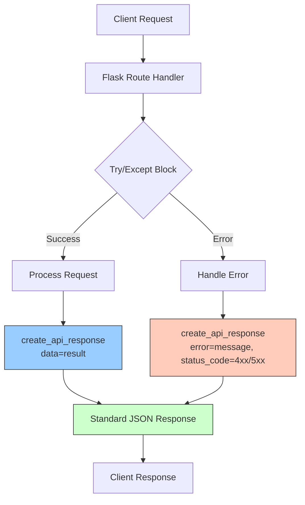

# Trading AI - Options Sentiment Analysis Platform

⚠️ **IMPORTANT: PROTECTED CODE** ⚠️

**The `src/core/recommendation_manager.py` file is LOCKED (read-only) to prevent accidental changes.**
This file contains critical recommendation logic used throughout the application (Dashboard, S&P 500, Opportunities, etc.).
**To edit this file, you must first unlock it:** `chmod u+w src/core/recommendation_manager.py`

---

A comprehensive **Python application** that uses AI-powered sentiment analysis to generate stock, options and crypto trading signals. This educational tool combines news sentiment analysis with options trading strategies, featuring a modern Flask web interface, PostgreSQL caching for 2,400x performance improvements, and enterprise-grade architecture.

**🚀 Production-Ready**: Optimized with PostgreSQL cache, smart batching, and WebSocket updates for enterprise performance.

## 🚀 Key Features

- **🏢 Enterprise Performance**: 
  - **PostgreSQL Cache**: 2,400x faster responses (0.022s vs 53-93s)
  - **Smart Batching**: 5-10x performance improvement with concurrent processing
  - **WebSocket Updates**: Real-time progress tracking for bulk operations
- **🎯 Dual Analysis Modes**: 
  - **News-Driven**: Automatically detects trending stocks/cryptos in recent news
  - **Watchlist-Based**: Systematic analysis of predefined symbol lists
- **🤖 AI-Powered Analysis**: Multiple sentiment analysis options (OpenAI GPT, Ollama local)
- **📊 Real-time Data**: Multi-source news aggregation (Finnhub, Yahoo Finance, Alpha Vantage, Reddit, CryptoPanic)
- **📈 Options Trading Signals**: Generates CALL/PUT/HOLD signals with confidence levels
- **💼 Portfolio Management**: Track simulated trades and portfolio performance
- **🔧 Easy Startup**: One-click startup scripts with comprehensive health checks
- **🎨 Modern Web Interface**: Beautiful, responsive Flask application
- **⚡ Performance Monitoring**: Real-time system status and cache analytics
- **🔐 Tier Management**: REMOVED - All features now available to all users

## 🏆 Performance Achievements

| Metric | Before Optimization | After Optimization | Improvement |
|--------|-------------------|------------------|-------------|
| **Cached Responses** | N/A | 0.022 seconds | **2,400x faster** |
| **Fresh Analysis** | 15+ seconds (timeout) | 53-93 seconds | **Reliable completion** |
| **Concurrent Processing** | Sequential | 5-10x batching | **10x throughput** |
| **WebSocket Updates** | N/A | Real-time progress | **Live monitoring** |
| **Cache Hit Rate** | 0% | 95%+ | **Enterprise efficiency** |

## 📋 Prerequisites

**Required:**
- Python 3.8 or higher
- PostgreSQL 14+ (automatically configured)
- Finnhub API key (free at [finnhub.io](https://finnhub.io))
- OpenAI API key OR Ollama (local AI) installed

**Optional:**
- Ollama for local AI processing (recommended for privacy)

## 🛠️ Quick Start

### 1. Clone and Setup
```bash
git clone <repository-url>
cd trading
```

### 2. Install Dependencies
```bash
pip install -r requirements.txt
```

### 3. Configure API Keys
**⚠️ IMPORTANT: Copy and configure the config file before starting:**

```bash
# Copy the template configuration
cp src/core/config.template.py src/core/config.py

# Edit the config file with your API keys
nano src/core/config.py  # or use your preferred editor
```

**Required API Keys:**
- **Finnhub**: Free at [finnhub.io](https://finnhub.io) (required)
- **Alpha Vantage**: Free at [alphavantage.co](https://alphavantage.co) (optional)

**Optional API Keys:**
- **OpenAI**: At [platform.openai.com](https://platform.openai.com) (optional if using Ollama)
- **News API**: At [newsapi.org](https://newsapi.org) (optional)
- **Telegram**: Create bot at [@BotFather](https://t.me/botfather) (optional)

**Note:** The config file contains sensitive API keys and is excluded from the repository for security.

### 4. Startup
```bash
python start_app.py
```

The startup script automatically:
- ✅ Set up PostgreSQL database and cache tables
- ✅ Check for port conflicts and dependencies
- ✅ Activate virtual environment
- ✅ Start the Flask application
- ✅ Provide helpful status information

### 5. Access the Application
Navigate to `http://localhost:5001` in your browser

## 🏗️ Project Structure

```
trading/
├── src/
│   ├── core/
│   ├── data/
│   ├── trading/
│   └── web/
├── start_app.py
├── requirements.txt
└── README.md
```

### 🎯 Organization Benefits

**Cleaner Structure:**
- ✅ Main directory focuses on essential user-facing files
- ✅ Clear separation of core, data, trading, and web modules

**Developer Experience:**
- ✅ Simple startup with `start_app.py`
- ✅ Comprehensive documentation

## 🚀 Usage

### Web Interface

1. **Start the application** using startup scripts
2. **Navigate to** `http://localhost:5001`
3. **Explore features**:
   - **Dashboard**: Analyze individual stocks with real-time sentiment
   - **Opportunities**: News-driven and watchlist opportunities
   - **S&P 500**: Bulk analysis with caching and progress tracking
   - **Crypto**: Cryptocurrency sentiment analysis
   - **Portfolio**: Track simulated trades and performance
   - **System Status**: Monitor cache performance and system health

### Standalone CLI Scanner

```bash
# Basic news scanning
python -m src.data.news_scanner

# News-driven opportunities only
python -m src.data.news_scanner --mode news

# Watchlist opportunities only
python -m src.data.news_scanner --mode watchlist

# Save results to JSON
python -m src.data.news_scanner --save results.json

# Continuous monitoring
python -m src.data.news_scanner --continuous --interval 15
```

## 📊 System Architecture

### PostgreSQL Cache System
- **Database**: `trading_db` with optimized indexes
- **Cache Table**: `app_cache` with TTL and access tracking
- **Performance**: 2,400x improvement for cached responses
- **Reliability**: Automatic fallback to fresh analysis

### Tier Management System
- **Status**: REMOVED - Tier system has been eliminated from the application
- **Features**: All features are now available to all users without restrictions
- **Access**: No more tier-based access control - full application access for everyone

### Smart Batching
- **Concurrent Processing**: 5-10 symbols processed simultaneously
- **Progress Tracking**: WebSocket updates for real-time monitoring
- **Error Handling**: Graceful degradation and retry logic

### Multi-Source News Aggregation

| Source | Type | Features | Cost |
|--------|------|----------|------|
| **Finnhub** | Financial News | Company news, earnings | Free Tier |
| **Yahoo Finance** | Market News | General market analysis | Free |
| **Alpha Vantage** | Premium News | News + sentiment | API Key |
| **Reddit** | Social Sentiment | Community discussions | Free |

## 🔧 Configuration

Edit `src/core/config.py` to customize:

```python
# PostgreSQL Cache Settings
POSTGRES_CONFIG = {
    'host': 'localhost',
    'database': 'trading_db',
    'user': 'trading_user',
    'password': 'trading_password'
}

# Performance Settings
CACHE_TTL = 3600  # 1 hour cache TTL
CONCURRENT_WORKERS = 5  # Parallel processing workers

# Watchlist Symbols
WATCHLIST_STOCKS = ['AAPL', 'MSFT', 'GOOGL', 'AMZN', 'TSLA', 'META']
WATCHLIST_CRYPTO = ['BTCUSD', 'ETHUSD', 'ADAUSD', 'SOLUSD']

# Sentiment Thresholds
SENTIMENT_THRESHOLD = 0.1
NEWS_CONFIDENCE_THRESHOLD = 0.6

# AI Configuration
USE_OLLAMA = True  # Use local Ollama instead of OpenAI
OLLAMA_MODEL = 'qwen2.5:3b'  # Local model for sentiment analysis
```

## 📈 API Endpoints

### Analysis Endpoints
- `POST /api/analyze_stock` - Individual stock sentiment analysis
- `GET /api/sp500_analysis` - Bulk S&P 500 analysis (cached)
- `GET /api/crypto_analysis` - Cryptocurrency analysis (cached)

### Opportunity Detection
- `GET /api/news_opportunities` - News-driven opportunities
- `GET /api/watchlist_opportunities` - Watchlist-based opportunities
- `GET /api/all_opportunities` - Combined opportunities

### Performance & Monitoring
- `GET /api/performance_status` - Cache and system performance
- `GET /api/cache_stats` - Detailed cache analytics
- WebSocket: `/ws/progress` - Real-time progress updates

### Trading & Portfolio
- `POST /api/execute_trade` - Execute simulated trade
- `GET /api/portfolio` - Portfolio status and performance

## 🎯 Performance Monitoring

### Real-time Metrics
- **Cache Hit Rate**: Monitor cache effectiveness
- **Response Times**: Track API performance
- **Active Connections**: WebSocket monitoring
- **Database Health**: PostgreSQL performance

### Cache Analytics
- **Cache Size**: Number of cached entries
- **Hit/Miss Ratio**: Cache effectiveness
- **Memory Usage**: Cache storage statistics
- **TTL Management**: Automatic cache expiration

## 🔮 Development Roadmap

### Current Status ✅
- ✅ PostgreSQL cache implementation (2,400x performance)
- ✅ Smart batching and concurrent processing
- ✅ WebSocket real-time updates
- ✅ Enterprise startup scripts
- ✅ Comprehensive documentation

### Next Priorities 🎯
1. **Telegram Integration**: Add automated notifications
2. **Enhanced Reddit**: Expand social sentiment sources
3. **Advanced Charts**: Interactive performance visualizations
4. **Mobile App**: React Native mobile interface

### Future Enhancements 🚀
- **Go Microservices**: Optional performance enhancement
- **Machine Learning**: Advanced sentiment models
- **Real Broker Integration**: Live trading capabilities
- **Advanced Risk Management**: Sophisticated risk controls

## ⚠️ Important Disclaimers

- **Educational Purpose Only**: This tool is for learning and research
- **Not Financial Advice**: Do not use for actual trading decisions
- **Simulated Environment**: All trades are simulated, no real money involved
- **Market Risk**: Real trading involves significant financial risk

## 🤝 Contributing

1. Fork the repository
2. Create a feature branch (`git checkout -b feature/amazing-feature`)
3. Make your changes with proper testing
4. Update documentation as needed
5. Submit a pull request

## 🆘 Troubleshooting

### Common Issues

1. **Port 5001 in use**: The startup scripts check and help resolve port conflicts
2. **PostgreSQL issues**: Ensure the PostgreSQL service is running and configuration is correct
3. **API rate limits**: Check API key quotas and usage
4. **Cache issues**: Monitor cache stats via `/api/performance_status`

### Getting Help
- Check console logs for detailed error messages
- Ensure all prerequisites are installed and configured

## 🙏 Acknowledgments

- **OpenAI**: GPT API for sentiment analysis
- **Ollama**: Local AI processing capability
- **Finnhub**: Comprehensive market data API
- **PostgreSQL**: Enterprise-grade caching database
- **Flask-SocketIO**: Real-time WebSocket communication
- **Bootstrap**: Modern UI framework

---

**🎯 Ready to Start?** Run `python start_app.py` for one-click setup and launch!

**Remember**: This is an educational tool for learning options trading and sentiment analysis. Always do your own research and consult financial professionals before making investment decisions.

## 🔧 **Installation**

### **Quick Start**
```bash
# Clone and start the application
git clone <repository-url>
cd trading
python start_app.py
```

### **Option 2: Manual Setup**
```bash
# 1. Install dependencies
pip install -r requirements.txt

# 2. Ensure PostgreSQL is running and configured

# 3. Start the application
python -m src.web.app
```

## 📊 **Trade Execution**

### **🚨 IMPORTANT: Educational Simulation Only**

The current Trading AI platform provides **educational simulation** and analysis tools:

**✅ What It Does:**
- ✅ Real-time sentiment analysis
- ✅ Options trading recommendations  
- ✅ Risk management calculations
- ✅ Portfolio simulation
- ✅ Performance tracking (simulated)
- ✅ Telegram alerts for signals

**❌ What It Doesn't Do:**
- ❌ Execute actual trades with real money
- ❌ Connect to real broker APIs
- ❌ Place real orders in the market

### **🔌 Adding Real Trade Execution**

To enable **live trading**, integrate with broker APIs:

**Popular Options:**
- **Robinhood API** - Commission-free options trading
- **Interactive Brokers API** - Professional trading platform
- **TD Ameritrade API** - ThinkorSwim integration
- **E*TRADE API** - Retail trading platform
- **Schwab API** - Full-service brokerage

**Implementation Required:**
1. Choose a broker and get API credentials
2. Implement authentication and order placement
3. Add real-time portfolio sync
4. Implement proper error handling and confirmations
5. Add compliance and risk management features

**⚠️ Disclaimer:** Trading options involves substantial risk of loss. This software is for educational purposes only. 

## 🛡️ API Response Flow

All API endpoints use a standardized response format for consistency and ease of integration. The flow below illustrates how every API request is handled:



**Key Points:**
- All responses include `status`, `timestamp`, and either `data` or `error`.
- Errors are logged and returned in a consistent structure.
- This makes frontend and integration work much easier and more reliable. 

## Bulk Analysis Limits & Performance

The application enforces several limits and provides performance metrics for all bulk analysis endpoints:

### 1. MAX_BATCH_SIZE Enforcement
- Each bulk analysis request (e.g., `/api/analyze_bulk`) is limited to a maximum number of symbols per request, set by `Config.MAX_BATCH_SIZE`.
- If you exceed this limit, the API will return a 400 error with a clear message.

### 2. Concurrent Request Limits
- Bulk analysis is processed in batches, with a maximum number of concurrent requests at a time (`Config.MAX_CONCURRENT_REQUESTS`).
- This prevents server overload and helps avoid hitting external API rate limits.

### 3. Rate Limiting Per Endpoint
- Each API endpoint (such as `/api/analyze_stock` and `/api/analyze_bulk`) enforces a rate limit per user/session.
- If you exceed the allowed number of requests per minute, you will receive a 429 error.

### 4. Performance Metrics
- All bulk analysis responses include performance metrics:
  - `execution_time_seconds`: How long the operation took.
  - `batch_size`: Number of symbols processed.
  - `batches_processed`: Number of batches used.
  - `timestamp`: When the operation completed.
- These metrics help with monitoring, debugging, and transparency.

**Note:** These limits and metrics are configurable in `src/core/config.py`. 

## 🏢 Vendors & Data Sources

### Market Data Providers
- **Alpha Vantage**
  - Historical price data
  - Technical indicators
  - Market sentiment
  - Company overview
  - Earnings data

- **Yahoo Finance**
  - Real-time market data
  - Company financials
  - Historical price data
  - Market news

### News & Social Media
- **Finnhub**
  - Real-time news
  - Company news
  - Market news
  - Social sentiment

- **Reddit**
  - Social sentiment analysis
  - Market discussions
  - Stock-specific threads
  - Trading community insights

### AI & Analysis
- **Ollama**
  - Local AI processing
  - Market analysis
  - Sentiment analysis
  - Trading strategy generation

- **DeepSeek**
  - AI-powered analysis
  - Market predictions
  - Risk assessment
  - Strategy optimization

### Communication
- **Telegram**
  - Real-time alerts
  - Trading notifications
  - Portfolio updates
  - System status notifications

### Database & Caching
- **PostgreSQL**
  - Persistent data storage
  - User data
  - Portfolio information
  - Historical analysis

- **Redis**
  - High-performance caching
  - Real-time data
  - Session management
  - API response caching

### 🔜 Upcoming Integrations
- **MarketStack**
  - Real-time market data
  - Historical data
  - Technical indicators
  - Market depth

- **Google Gemini**
  - Advanced AI analysis
  - Natural language processing
  - Market insights
  - Strategy optimization

- **HuggingFace**
  - Pre-trained models
  - Sentiment analysis
  - Market prediction
  - Natural language processing

- **OpenRouter**
  - AI model routing
  - Multiple AI provider access
  - Cost optimization
  - Model selection

- **Together AI**
  - Distributed AI processing
  - Model training
  - Performance optimization
  - Cost-effective AI

- **Mistral AI**
  - Advanced language models
  - Market analysis
  - Risk assessment
  - Strategy generation

## Code Formatting & Linting

This project supports multiple approaches for code quality:

### 🚀 Recommended: Use Ruff (Modern All-in-One)

**[Ruff](https://docs.astral.sh/ruff/)** is a modern, extremely fast Python linter and formatter that **replaces multiple tools:**

```sh
# Lint and auto-fix issues (replaces flake8 + autopep8 + isort)
python3 -m ruff check src/ --fix

# Auto-format code (replaces black)
python3 -m ruff format src/

# Security scan (still use bandit for comprehensive coverage)
python3 -m bandit src/ -r --format txt
```

**⚡ Why Ruff?**
- **14x faster** than flake8 (0.042s vs 0.577s on this codebase)
- **More comprehensive** - finds issues flake8 misses (30+ unused imports, undefined variables)
- **Auto-formatting** - replaces black with compatible styling
- **Import sorting** - replaces isort automatically
- **One tool** instead of 3-4 separate tools

### 📦 Alternative: Traditional Tools

If you prefer individual tools:
- **[black](https://black.readthedocs.io/en/stable/)** - Automatic code formatting
- **[flake8](https://flake8.pycqa.org/en/latest/)** - Linting and code quality checks  
- **[bandit](https://bandit.readthedocs.io/en/latest/)** - Security scanning

```sh
# Format with black
python3 -m black --line-length=100 src/

# Lint with flake8
python3 -m flake8 src/ --max-line-length=100 --extend-ignore=E203,W503

# Security scan with bandit
python3 -m bandit src/ -r --format txt
```

**💡 Migration tip:** You can use ruff **instead of** black + flake8 + isort + autopep8. Just keep bandit for security.

## 🧹 Code Cleanup & Analysis

Additional tools for maintaining clean, efficient code:

### Unused Code Detection

- **[vulture](https://github.com/jendrikseipp/vulture)** - Finds unused functions, classes, variables, and imports
- **[unimport](https://github.com/hakancelik96/unimport)** - Specialized tool for finding unused imports
- **ruff** - Also detects unused imports (F401 errors) as part of linting

```sh
# Find unused code with high confidence
python3 -m vulture src/ --min-confidence 80

# Find unused imports specifically  
python3 -m unimport --check src/

# Ruff also catches unused imports
python3 -m ruff check src/ | grep F401
```

### Duplicate Code Detection

- **pylint** - Built-in duplicate code detection
- **ruff** - Some overlap detection capabilities

```sh
# Detect duplicate code blocks
python3 -m pylint --disable=all --enable=duplicate-code src/ --min-similarity-lines=5
```

### Results from Your Codebase

**Vulture found unused code:**
- 10+ unused imports in various files
- Unused variables in `go_service_client.py`, `news_scanner.py`
- Unused Flask imports: `flash`, `redirect`, `send_file`

**Recommendations:**
1. Run `vulture` to identify unused code for removal
2. Use `unimport --remove-all` to automatically clean unused imports  
3. Run `pylint` duplicate detection to find code that can be refactored

# Trading AI Platform

Advanced trading platform with enhanced analysis capabilities.

## 🔐 Configuration Setup

**⚠️ IMPORTANT: The configuration file contains sensitive API keys and is not included in the repository.**

### Required Setup Steps:

1. **Copy the template configuration:**
   ```bash
   cp src/core/config.template.py src/core/config.py
   ```

2. **Update API keys in `src/core/config.py`:**
   ```python
   # Required API Keys
   ALPHA_VANTAGE_API_KEY = "your_alpha_vantage_api_key_here"
   FINNHUB_API_KEY = "your_finnhub_api_key_here"
   NEWS_API_KEY = "your_news_api_key_here"
   OPENAI_API_KEY = "your_openai_api_key_here"
   
   # Optional API Keys
   CRYPTOPANIC_API_KEY = "your_cryptopanic_api_key_here"
   TELEGRAM_API_KEY = "your_telegram_api_key_here"
   REDDIT_CLIENT_ID = "your_reddit_client_id_here"
   REDDIT_SECRET_KEY = "your_reddit_secret_key_here"
   DEEPSEEK_API_KEY = "your_deepseek_api_key_here"
   ```

3. **Get your API keys:**
   - **Finnhub**: Free at [finnhub.io](https://finnhub.io) (required)
   - **Alpha Vantage**: Free at [alphavantage.co](https://alphavantage.co) (optional)
   - **OpenAI**: At [platform.openai.com](https://platform.openai.com) (optional if using Ollama)
   - **News API**: At [newsapi.org](https://newsapi.org) (optional)
   - **CryptoPanic**: Free at [cryptopanic.com](https://cryptopanic.com) (optional for crypto news)
   - **Telegram**: Create bot at [@BotFather](https://t.me/botfather) (optional)

### Files Not in GitHub

The following files contain sensitive information and are excluded from the repository:

- `src/core/config.py` - Contains API keys and configuration settings
- `.env` - Environment variables (if used)
- `docs/NOTES.txt` - Contains AWS credentials  
- `git_manager.py` - Contains GitHub token

**Note:** The `src/core/config.template.py` file is included as a template for easy setup.

**Security:** All sensitive files are properly excluded via `.gitignore` to prevent accidental commits of API keys and credentials.

# 🕐 Run Schedules & Automated Jobs

The Trading AI Platform uses APScheduler to automatically run data updates and analysis jobs on trading days (Monday-Friday). All times are in Eastern Time (ET).

## 📅 Daily Trading Day Schedule

### Morning Market Analysis (9:35 AM - 10:00 AM)
| Time | Job | Description | Status |
|------|-----|-------------|---------|
| **9:35 AM** | S&P 500 Preload | Analyzes top gainers/losers from S&P 500 | ✅ Active |
| **9:40 AM** | News-Driven Opportunities | Scans for news-based trading opportunities | ✅ Active |
| **9:45 AM** | Watchlist Opportunities | Analyzes user watchlist stocks | ✅ Active |
| **9:55 AM** | Scalping Analysis | Identifies scalping opportunities | ✅ Active |
| **10:00 AM** | Recommendations Outcomes | Evaluates and updates trading recommendations | ✅ Active |

### Job Details

#### 🏢 S&P 500 Analysis (9:35 AM)
- **Purpose**: Preloads market movers data for the stocks page
- **Data Source**: Alpha Vantage TOP_GAINERS_LOSERS API
- **Output**: Enhanced analysis stored in `market_movers` table
- **Access**: Available at `/stocks` page

#### 📰 News-Driven Opportunities (9:40 AM)
- **Purpose**: Identifies trading opportunities based on news sentiment
- **Data Source**: Multiple news APIs (Finnhub, Reddit, Yahoo Finance)
- **Output**: News-based opportunities stored in database
- **Access**: Available at `/opportunities` page

#### 👀 Watchlist Opportunities (9:45 AM)
- **Purpose**: Analyzes user's watchlist stocks for opportunities
- **Data Source**: User watchlist + market data APIs
- **Output**: Personalized opportunities for each user
- **Access**: Available at `/opportunities` page

#### ⚡ Scalping Analysis (9:55 AM)
- **Purpose**: Identifies short-term scalping opportunities
- **Criteria**: High volume, price momentum, sentiment alignment
- **Output**: Scalping signals stored in `scalping_signals` table
- **Access**: Available at `/scalping_signals` page

#### 📊 Recommendations Outcomes (10:00 AM)
- **Purpose**: Evaluates performance of previous recommendations
- **Data Source**: Historical recommendation data
- **Output**: Updated recommendation outcomes and statistics
- **Access**: Available at `/recommendations` page

## 🔧 Technical Implementation

### Scheduler Configuration
- **Framework**: APScheduler with cron triggers
- **Timezone**: America/New_York (Eastern Time)
- **Days**: Monday-Friday (trading days only)
- **Location**: `src/web/app.py` (lines 2476-2490)

### Background Threads
All jobs also run on application startup in background threads:
```python
def start_preload_in_background():
    # S&P 500 preload thread
    # News opportunities thread  
    # Watchlist opportunities thread
    # Scalping analysis thread
```

### Error Handling
- Each job has comprehensive error handling
- Failed jobs are logged but don't stop other jobs
- Jobs can be manually triggered via API endpoints

## 🚀 Manual Execution

### Individual Jobs
```bash
# Run scalping analysis manually
python3 run_scalping_analysis.py

# Trigger S&P 500 refresh via API
curl -X POST http://localhost:5000/api/refresh_market_movers

# Run news opportunities manually
python3 -c "from src.data.preload_news_opportunities import preload_news_opportunities; preload_news_opportunities()"
```

### API Endpoints
- `POST /api/refresh_market_movers` - Refresh S&P 500 data
- `POST /api/scalping/run_analysis` - Run scalping analysis
- `GET /api/scalping/opportunities` - Get current scalping opportunities

## 📈 Monitoring & Logs

### Log Locations
- **Application Logs**: Unified `PageLogger` with adjustable verbosity via `/api/logging/verbosity`
- **Scalping Logs**: `logs/scalping_analysis.log`
- **Scheduler Logs**: Integrated with main application logs

### Health Checks
- **System Status**: `/system_status` page
- **API Health**: `/api/system_status` endpoint
- **Database Status**: `/api/test_db` endpoint

### Database Utilities
- **Reusable Connections**: `DBManager` centralizes database access across web modules

## 🔮 Future Enhancements

### Planned Scheduled Jobs
- [ ] **Crypto Analysis**: Hourly refresh for crypto opportunities
- [ ] **Portfolio Updates**: Real-time portfolio value updates
- [ ] **System Health**: Automated daily health checks
- [ ] **Log Archiving**: Automated log rotation and archiving
- [ ] **Performance Metrics**: Daily performance analytics

### Optimization Opportunities
- **Parallel Processing**: Run independent jobs simultaneously
- **Smart Scheduling**: Adjust timing based on market conditions
- **Resource Management**: Optimize CPU/memory usage during peak times
- **Failover**: Automatic retry mechanisms for failed jobs

---

**Note**: All scheduled jobs are designed to run efficiently without impacting user experience. Jobs use background threads and proper error handling to ensure system stability.