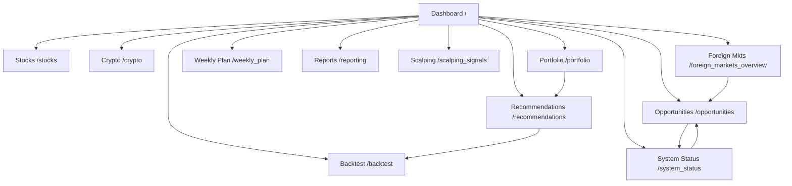

# Trading AI Web Application Overview

## Page Summaries
| Page | Access Point | Purpose & Key Features | Refactor/Update Estimate (hrs) | Mobile Readiness Estimate (hrs) |
| --- | --- | --- | --- | --- |
| Dashboard | `/` | Landing hub with sticky analysis controls for standard/enhanced runs, progress/status feedback, educational "How it Works" walkthrough, and a built-in debug monitor for AI sentiment runs that draws configuration values from the backend service layer.【F:src/web/routes/page_routes.py†L14-L26】【F:src/web/templates/index.html†L6-L240】 | 10 | 8 |
| Stocks | `/stocks` | Pulls the latest winners/losers from the database with fallback handling, then renders enhanced analysis summaries, refresh workflows, auto-refresh toggles, and sentiment-driven tables/modals for top movers.【F:src/web/routes/page_routes.py†L29-L97】【F:src/web/templates/stocks.html†L10-L200】 | 12 | 9 |
| Crypto | `/crypto` | Presents crypto watchlist sentiment controls, dynamic opportunity cards, market overview metrics, distribution charts, and risk guidance tailored to 24/7 trading.【F:src/web/routes/page_routes.py†L100-L106】【F:src/web/templates/crypto.html†L6-L195】 | 8 | 7 |
| Portfolio | `/portfolio` (`/portfolio_page`) | Simulated portfolio workspace with mock-data warning, add-position workflow, KPI cards, open positions/trades tables, and allocation/performance visualizations.【F:src/web/routes/page_routes.py†L109-L123】【F:src/web/templates/portfolio.html†L6-L220】 | 6 | 6 |
| Foreign Markets Overview | `/foreign_markets_overview` | Global exchange monitor featuring summary KPIs, regional/status filters, async refresh, modal drill-downs, and links back to opportunities analysis.【F:src/web/routes/page_routes.py†L126-L132】【F:src/web/templates/foreign_markets_overview.html†L6-L200】 | 7 | 6 |
| Opportunities | `/opportunities` | Real-time opportunity scanner with mode toggles (news vs. watchlist), refreshable feed, debug panel, and configuration cues tied to watchlist settings.【F:src/web/routes/page_routes.py†L138-L148】【F:src/web/templates/opportunities.html†L10-L180】 | 9 | 7 |
| Weekly Plan | `/weekly_plan` | Calendar-style planner supporting week navigation, multi-filter controls, summary metrics, detailed event tables, and watchlist highlights.【F:src/web/routes/page_routes.py†L151-L156】【F:src/web/templates/weekly_plan.html†L7-L200】 | 6 | 5 |
| Logs | `/logs` | Operational log console offering extensive filters, auto-refresh, export, modal search, and verbose toggles for deep diagnostics.【F:src/web/routes/page_routes.py†L160-L165】【F:src/web/templates/logs.html†L10-L200】 | 7 | 5 |
| Recommendations | `/recommendations` | Performance dashboard aggregating KPIs, charts, filterable recommendation tables, and performance summaries for AI strategies.【F:src/web/routes/page_routes.py†L169-L174】【F:src/web/templates/recommendations.html†L10-L200】 | 10 | 7 |
| Reporting | `/reporting` | Multi-section analytics studio with configurable reporting periods/types, loading states, and rich performance/trading/risk visualizations.【F:src/web/routes/page_routes.py†L178-L183】【F:src/web/templates/reporting.html†L6-L200】 | 11 | 8 |
| Backtest | `/backtest` | Strategy validation surface that ties into API endpoints for custom/historical runs, surfacing results via dedicated template views.【F:src/web/routes/backtest_routes.py†L29-L66】【F:src/web/templates/backtest.html†L6-L200】 | 9 | 6 |
| Scalping Signals | `/scalping_signals` | Real-time scalping hub that queries PostgreSQL history, exposes manual/auto API triggers, and renders contextualized signal cards with headlines.【F:src/web/scalping_signals.py†L30-L148】【F:src/web/templates/scalping_signals.html†L19-L200】 | 10 | 7 |
| System Status | `/system_status` | Health cockpit with refresh/auto-refresh controls, system/database/service KPIs, cache statistics, and operational summaries pulled from service aggregators.【F:src/web/routes/system_routes.py†L28-L76】【F:src/web/templates/system_status.html†L8-L200】 | 8 | 6 |

**Total estimated hours**

- Refactor/update work: **113 hours**
- Mobile readiness work: **87 hours**

## Navigation Flow

## Mobile Compatibility & Store Readiness Plan
- **Responsive enhancements (per page)**: Apply the page-level mobile estimates above to tune layouts (Bootstrap grid refinements, collapsible tables/cards, mobile-first charts), ensure touch-friendly controls, and validate accessibility breakpoints.
- **Cross-platform wrapping (24 hrs)**: Ship a Progressive Web App shell and configure Capacitor (or similar) wrappers for Android/iOS, including build pipelines and native integrations (icons, splash screens, secure storage).
- **Device QA (18 hrs)**: Run smoke/regression tests across representative Android/iOS hardware and emulators, covering performance, gesture handling, offline/PWA behaviour, and dark-mode validation.
- **Store launch (22 hrs)**: Produce store assets/metadata, finalize privacy/compliance docs, manage signing credentials, and shepherd submissions through Google Play Console and Apple App Store review.

**Total mobile release effort**: 87 hours (page-specific responsive work) + 64 hours (wrapping, QA, store launch) = **151 hours**.
