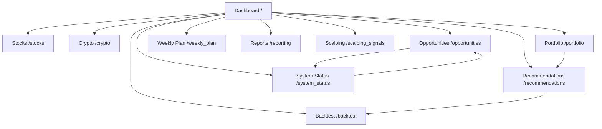

# Trading AI Web Application Overview

## Page Summaries
| Page | Access Point | Purpose & Key Features | Refactor/Update Estimate (hrs) | Mobile Readiness Estimate (hrs) |
| --- | --- | --- | --- | --- |
| Dashboard | `/` | Main entry point with symbol input, standard/enhanced analysis triggers, real-time progress feedback, and detailed walkthrough of AI-driven trade generation.【F:src/web/routes/page_routes.py†L14-L26】【F:src/web/templates/index.html†L6-L175】 | 10 | 8 |
| Stocks | `/stocks` | Loads real S&P 500 movers from the database, highlights winners/losers, and offers refreshed sentiment-backed recommendations with market overview widgets.【F:src/web/routes/page_routes.py†L29-L97】【F:src/web/templates/stocks.html†L10-L200】 | 12 | 9 |
| Crypto | `/crypto` | Provides crypto sentiment dashboards, refresh controls, distribution charts, and watchlist-driven trading signals for major coins.【F:src/web/routes/page_routes.py†L100-L106】【F:src/web/templates/crypto.html†L6-L195】 | 8 | 7 |
| Portfolio | `/portfolio` (`/portfolio_page`) | Simulated portfolio management with position entry forms, KPI cards, and tables for positions/trades (explicitly marked as mock data).【F:src/web/routes/page_routes.py†L109-L123】【F:src/web/templates/portfolio.html†L12-L188】 | 6 | 6 |
| Foreign Markets Overview | `/foreign_markets_overview` | Global exchange monitor with summary stats, region/status filters, refresh workflow, and modal drill-down into market details.【F:src/web/routes/page_routes.py†L126-L132】【F:src/web/templates/foreign_markets_overview.html†L6-L190】 | 7 | 6 |
| Opportunities | `/opportunities` | Aggregates news-driven and watchlist signals, exposes mode filters, refresh workflows, and configuration guidance tied to system settings.【F:src/web/routes/page_routes.py†L138-L148】【F:src/web/templates/opportunities.html†L9-L190】 | 9 | 7 |
| Weekly Plan | `/weekly_plan` | Calendar-style planner with week navigation, event filters, summary cards, and detailed schedules for upcoming market events.【F:src/web/routes/page_routes.py†L151-L156】【F:src/web/templates/weekly_plan.html†L7-L180】 | 6 | 5 |
| Logs | `/logs` | Operational monitoring page featuring filterable log streams, auto-refresh controls, export options, and search modal for diagnostics.【F:src/web/routes/page_routes.py†L160-L165】【F:src/web/templates/logs.html†L10-L196】 | 7 | 5 |
| Recommendations | `/recommendations` | Performance dashboard with KPI cards, charts, filters, and interactive tables summarizing AI-generated trade ideas.【F:src/web/routes/page_routes.py†L169-L174】【F:src/web/templates/recommendations.html†L7-L198】 | 10 | 7 |
| Reporting | `/reporting` | Advanced analytics workspace with date selection, report generation/export, performance metrics, and multi-section visualizations.【F:src/web/routes/page_routes.py†L178-L183】【F:src/web/templates/reporting.html†L6-L200】 | 11 | 8 |
| Backtest | `/backtest` | Strategy validation interface with configuration form, live debug banner, and historical statistics driven by stored recommendations.【F:src/web/routes/backtest_routes.py†L29-L66】【F:src/web/templates/backtest.html†L6-L200】 | 9 | 6 |
| Scalping Signals | `/scalping_signals` | Real-time scalping hub with DB-backed signal history, filters by direction/asset, and tools to trigger new analyses.【F:src/web/scalping_signals.py†L30-L78】【F:src/web/templates/scalping_signals.html†L19-L199】 | 10 | 7 |
| System Status | `/system_status` | Health dashboard showing performance metrics, database/cache status, and service overviews with auto-refresh controls.【F:src/web/routes/system_routes.py†L28-L63】【F:src/web/templates/system_status.html†L7-L200】 | 8 | 6 |

**Total estimated hours**

- Refactor/update work: **113 hours**
- Mobile readiness work: **87 hours**

## Navigation Flow

## Mobile Compatibility & Store Readiness Plan
- **Responsive enhancements (per page)**: Allocate the page-level mobile hours above to refactor layouts (Bootstrap grid tuning, touch-friendly controls, chart responsiveness), consolidate shared mobile styles, and verify accessibility.
- **Cross-platform wrapping (24 hrs)**: Package the responsive web app as a Progressive Web App and configure WebView shells (e.g., Capacitor) for Android and iOS deployment, including device integrations.
- **Device QA (18 hrs)**: Execute smoke/regression tests on representative Android (phone/tablet) and iOS (iPhone/iPad) hardware and emulators, addressing viewport, gesture, and performance issues.
- **Store launch (22 hrs)**: Prepare assets, privacy policies, and metadata, configure signing/build pipelines, and guide through Google Play Console and Apple App Store submission/review cycles.

**Total mobile release effort**: 87 hours (page-specific responsive work) + 64 hours (wrapping, QA, store launch) = **151 hours**.
